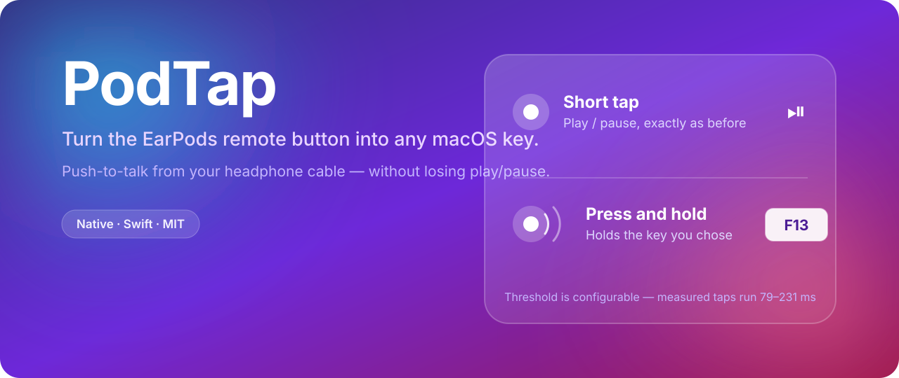

<p align="center">
  
</p>

<p align="center">
  <a href="https://github.com/ixjosemi/podtap/releases"></a>
  
  
  <a href="LICENSE"></a>
</p>

# PodTap

**PodTap turns the button on your wired Apple EarPods into any macOS key you
want — while keeping play/pause exactly where it was.**

- **Short tap** → play/pause, unchanged.
- **Press and hold** → holds down the key you chose, and releases it when you
  let go.

The button becomes a proper push-to-talk trigger. Hold it, talk, let go. It
works with Wispr Flow, Superwhisper, macOS Dictation, Discord, Slack huddles, or
anything else driven by a held key.

Everything is configured in the app. There is no config file, no scripting, and
nothing to compile.

---

## Why this exists

There was no way to do this. The
[Karabiner-Elements issue asking for it](https://github.com/pqrs-org/Karabiner-Elements/issues/2398)
has been open for years with no resolution. Every existing tool in this space —
[MediaKeyTap](https://github.com/the0neyouseek/MediaKeyTap),
[mac-media-keys](https://github.com/rayhatfield/mac-media-keys),
[mac-bt-headset-fix](https://github.com/jguice/mac-bt-headset-fix) — forwards
media keys to a *player*. None of them let you remap the button to an arbitrary
key.

## Install

Download the latest `.dmg` from
[Releases](https://github.com/ixjosemi/podtap/releases) and drag PodTap to
Applications. Every release is built by GitHub Actions from a tagged commit, as
a universal binary that runs on both Apple Silicon and Intel.

PodTap is **not notarised** — that needs a paid Apple Developer account — so
macOS quarantines it on download. Clear that once:

```sh
xattr -dr com.apple.quarantine /Applications/PodTap.app
```

Skipping this step is the usual cause of macOS refusing to open the app, or
claiming it is damaged.

Then open PodTap from Finder. A setup window walks you through the two required
permissions and lets you pick your key. Nothing works until those permissions
are granted, so setup asks for them up front rather than failing silently
later.

### What you can map it to

| Kind | Examples |
|---|---|
| A plain key | `F13`, `F18` |
| A key with modifiers | `⌘S`, `⌃⌥Space` |
| Modifiers on their own | `⌃⇧`, `⌥⇧` |
| Globe / Fn | `🌐` — the default trigger in several dictation apps |

Modifier-only shortcuts and Globe produce no key event on macOS, only modifier
transitions, so PodTap emits them the same way real keys do: one transition per
modifier, released in reverse.

Caps Lock is not offered. It latches rather than being held, so it cannot drive
a press-and-hold trigger.

| Permission | Why it is needed |
|---|---|
| **Input Monitoring** | To read the button on the EarPods remote. |
| **Accessibility** | To send the key you chose to whatever app you are typing in. |

Then set the same key as the shortcut in your dictation app, and you are done.

### Build from source

```sh
git clone https://github.com/ixjosemi/podtap.git
cd podtap
./Scripts/build-app.sh          # produces build/PodTap.app
./Scripts/build-dmg.sh          # produces build/PodTap-<version>.dmg
```

## Where PodTap lives

PodTap never appears in the Dock or the app switcher. By default it sits in the
menu bar, where the icon reflects state at a glance: ready, recording, or no
EarPods connected.

If you would rather not see it at all, turn off **Show icon in the menu bar** in
Settings and it becomes a pure background agent. Opening PodTap again from
Finder brings the settings window back, so hiding the icon is never a one-way
door.

## How it works

macOS presents the remote button as a play/pause toggle, but that is
information being thrown away higher up the stack. Underneath, USB-C EarPods are
an ordinary HID device publishing the `PlayPause` usage (`0x00CD`) on the
Consumer Page (`0x0C`), with genuine press and release transitions.

PodTap opens that device with `kIOHIDOptionsTypeSeizeDevice`, which stops the
event from reaching the system at all, and then decides what to do based on how
long the press lasted. Because the original event no longer exists, the
play/pause for a short tap is synthesised back.

Seizing is not optional. macOS synthesises play/pause on button *down*, so by
the time a `CGEventTap` could tell a hold from a tap, the music has already
paused. Only intercepting below that layer is early enough.

### Measurements from real hardware

Captured with the diagnostic tools in [`tools/`](tools), on USB-C EarPods
(`vid=0x05AC pid=0x110B`) running macOS 26.5:

| | n | range | median |
|---|---|---|---|
| Taps | 15 | 79 – 231 ms | ~111 ms |
| Holds | 2 | 1774 – 1947 ms | — |

The gap between the two groups is wide enough that a 300 ms threshold
classifies every sample correctly. Seizing was also confirmed to genuinely
block: with music playing, 17 presses produced not a single pause.

The threshold is adjustable in Settings, since how long *you* hold a button is
personal.

## Architecture

```
Sources/
  GestureCore/    Pure classification logic. No IOKit, no CoreGraphics.
  HIDInput/       IOHIDManager, exclusive seize, hotplug handling.
  KeyOutput/      CGEvent and play/pause synthesis.
  PodTapApp/      Menu bar, setup flow, settings, permissions.
tests/
  GestureCoreTests/
  KeyOutputTests/
tools/            Standalone HID probes used to derive the numbers above.
```

`GestureCore` has no system dependencies and takes its clock by injection, so
the entire state machine is tested without hardware or real time.

The one piece of undocumented API in the project is play/pause synthesis, which
needs `NSEvent.systemDefined` with the magic `0xa00`/`0xb00` flags. It is
deliberately confined to a single file: if Apple ever changes it, play/pause
passthrough breaks — button capture does not.

## Development

```sh
swift build
swift test
```

If `swift test` fails with `no such module 'XCTest'`, your `xcode-select` points
at the Command Line Tools rather than Xcode:

```sh
DEVELOPER_DIR=/Applications/Xcode.app/Contents/Developer swift test
```

### Keeping permissions across rebuilds

By default `build-app.sh` signs ad-hoc, which produces a designated requirement
pinned to the binary's hash. Every rebuild then looks like a different app to
macOS, and both permissions have to be granted again.

Signing with any valid certificate fixes this — including a free **Apple
Development** identity, which Xcode will create from a plain Apple ID at no
cost. The requirement becomes pinned to the bundle identifier and the
certificate instead of the hash, and stays identical across builds.

The script picks up a single available identity automatically. To choose:

```sh
security find-identity -v -p codesigning          # list what you have
PODTAP_SIGNING_IDENTITY="Apple Development: you@example.com (TEAMID)" \
  ./Scripts/build-app.sh
```

> **Check that the certificate is not revoked.** Signing with a revoked
> certificate makes macOS classify the app as malware and delete it — that is
> what revocation is for. `security find-identity` still lists revoked
> certificates as valid, because revocation is only checked online at
> assessment time. `build-app.sh` verifies with `spctl` after signing and falls
> back to ad-hoc rather than shipping something the system will quarantine.

If permissions still misbehave after switching, clear the stale entries once:

```sh
tccutil reset Accessibility com.github.ixjosemi.podtap
tccutil reset ListenEvent com.github.ixjosemi.podtap
```

## Scope

Wired **USB-C EarPods only**.

AirPods are deliberately out of scope: they arrive over Bluetooth AVRCP, expose
no HID device of their own, and cannot be seized this way. Support would need a
completely different and far less reliable mechanism.

## License

MIT.
